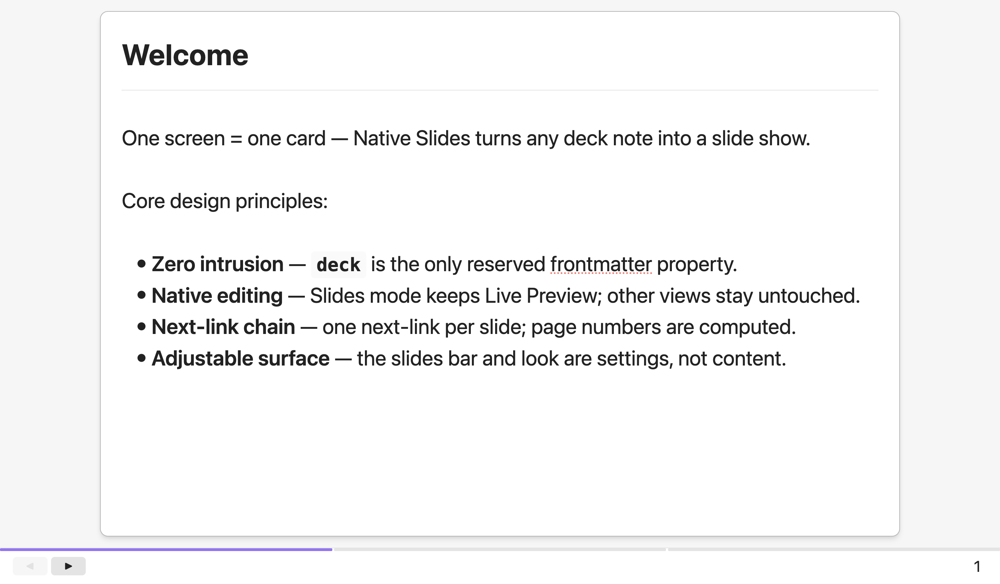

# Native Slides — 面向 deck 笔记的 Slides 模式

[English](README.md) | **简体中文**

> 一个 Obsidian 插件：把 deck 笔记变成 **Slides**——沉浸式、可编辑（Live Preview）的
> "一屏一卡"视图，slides 栏提供属性展示与 PPT 式翻页——由一个 frontmatter 属性驱动。

**设计原则** —— 零侵入（对笔记内容零改动、仅保留 `deck` 一个属性）、原生编辑（Slides 模式外一切保持默认）、next 链贯穿（单链接驱动页序）、界面可调（外观与 slides 栏皆设置项）；此外不持久化配置以外的内容、实现高效且代码规范优美。详见 [docs/design-zh.md](docs/design-zh.md)。



## 功能特性

- **Slides 模式**（仅 deck 笔记）：沉浸式、可编辑的卡片视图——"一屏一卡"。用 **Toggle Slides Mode** 命令（默认快捷键 `Mod+Shift+E`）进入；丝带、左右侧边栏与 tab 栏隐藏，幻灯片内容位于**居中卡片**（宽 80vw，主题自适应）内，外观可从 **六套内置样式模板**中选择——_Lecture (jyy)_（默认，参照 [jyywiki.cn](https://jyywiki.cn) 讲义的幻灯片卡片制作）、_虚线边框_、_纸片卡片_、_极简_、_强调边_、_磨砂玻璃_——每套模板同时重绘卡片与 slides 栏；默认隐藏文件名，可通过 **Slides title** 设置选择显示任意 frontmatter 属性（或 `filename` 显示文件名）作为卡片标题——**filename 标题可直接在卡片上编辑**（点击即可输入，重命名笔记，与原生 inline title 行为一致）；属性类标题为只读（请在笔记属性面板中修改），编辑器**裁切到单屏**（不滚动——超出折叠的内容被裁掉）且**始终从笔记开头开始**，slides 栏显示已配置的 bar properties、◀ ▶ 翻页与自动页号。退出时还原进入前的视图（Source / Live Preview / Reading）。
- **原生模式保持不动**：Source 模式、默认 Live Preview 与阅读视图都保持 Obsidian 默认行为——不隐藏状态栏、不加 slides 栏、不全屏、不改样式。Slides 模式是插件的唯一界面，因此可与其它也会修改阅读视图的插件和平共处。
- **PPT 式翻页**，只用一个保留属性 **`deck`**（next-only：至多一个 markdown 链接——下一张；没有概览页）：

  ```yaml
  # 放映页 —— 一个链接 = 下一张
  deck: ["[[slide-2]]"]
  # 最后一页 —— 没有链接（空列表）
  deck: []
  ```

  - **页号自动计算**：沿链接链（链头 → 第 2 页 → …）编号，从 1 开始（链头 = 第 1 页），无需再写 `page-number` 属性。
  - 点 slides 栏 ◀ ▶ 按钮翻页，或用 **上一页 / 下一页** 命令（默认快捷键 `Cmd/Ctrl+Shift+←/→`，可在 **设置 → 快捷键** 重新绑定）。在原生模式按下也会自动进入 Slides 并翻页。两个箭头始终显示；无法移动的那一个（第一页的 ◀、最后一页的 ▶）为浅灰色禁用态。
  - **Create Next Slide 命令**（仅 deck 笔记可用）：在当前笔记之后创建一张新幻灯片——新文件命名为 `<当前名>-next`（重名自动追加 `-2`、`-3`），`deck` 链接自动改写，新笔记以编辑模式打开，可直接输入内容。若当前笔记的 `deck` 链接指向不存在的笔记，则直接创建那个声明的笔记（顺带消除 ⚠ 警告）。
  - **Create New Slide 命令**（不属于任何 deck 的笔记可用）：**开启一套全新 deck**——新建一个笔记（`untitled-slides`，重名自动追加序号）作为第一页，frontmatter 为 `deck: []`；执行命令时所在的笔记保持原样不动。空白标签页也能用（新笔记落在 Obsidian 的"新笔记默认位置"）。之后在 deck 内用 Create Next Slide 继续加页。
  - **Initialize Slides with This Note 命令**（不属于任何 deck 的笔记可用）：把当前笔记提升为一套**全新 deck 的第一页**——内容、标题与位置原样保留，仅在 frontmatter 写入 `deck: []`（单页 deck）。适合"先写长文（讲义、项目笔记），再想演示"的场景：执行后自动进入 Slides 模式，效果立即可见。该命令只在尚未属于任何 deck 的笔记上出现在命令面板中，绝不会在 deck 笔记上误导性出现。

- **演示时没有闪烁光标**：点一下 slides 栏即可让编辑器失焦——讲解时不再有闪烁的输入光标；点回任意幻灯片内容即可继续编辑。**Toggle Mouse Pointer** 命令（`Mod+Shift+M`）更进一步：全窗口隐藏鼠标指针并顺带失焦；再执行一次恢复，退出 Slides 模式也会自动恢复。
- **可配置 slides 栏属性**：选择哪些 frontmatter 属性显示在 slides 栏中以及显示顺序。设置 → Bar properties 接受逗号分隔的列表（如 `series, level, date`）；每个值占据等宽列，列之间的分隔条可拖拽调整宽度（宽度跨会话持久化）。留空 = 不显示属性列。缺失的属性会被静默跳过。属性列排版与页号一致（均随 bar 高度缩放）：属性列为灰色弱化显示，页号保持醒目。
- **自动进入 Slides 模式**（设置项，默认关）：打开 deck 笔记直接进入 Slides；关闭则手动进入。
- **图片居中**（设置项，默认开）：Slides 模式下图片居中渲染为卡片块，行高恰好等于图片本身。关闭则恢复 Obsidian 的常规行为——图片与文字同行（小图及其说明文字排在同一行）。
- **Copy AI agent prompt 命令**（仅在 Slides 模式下）：把一份适合给 AI 用的说明复制到剪贴板——先介绍插件机制（一屏一卡；`deck` 链属性；Create new/next slide 如何接链），再给出实时布局实测：真实文字区（已扣掉 slides 栏与卡片标题）、一屏能放多少行正文/每行多少拉丁字符或汉字、各元素类型（H1/H2/H3、正文、列表项、代码行、第一张图）的行高（优先实测当前笔记，缺失类型按 Slides 固定排版变量推算），以及容量示例："20 行正文"、"H1 + 19 个列表项"等。文案跟随 Obsidian 界面语言——用它向 AI 索要幻灯片：把你的需求（如"基于某材料制作 slides 笔记"）写在前面，再把这份说明粘贴在中间。
- **设置页**：可选择样式模板、配置 bar properties，可开关 ◀ ▶ 按钮、页号显示与自动进入；Obsidian 1.13.0+ 下各项设置可被设置搜索索引。
- **断链警告**：`deck` 链接指向不存在的笔记时，slides 栏显示 ⚠ 警告标签，方便作者发现笔误（该链只会终止或排除，不会报错）。
- **命令**：_Toggle Slides Mode_（`Mod+Shift+E`）、_Previous Page / Next Page_（`Mod+Shift+←/→`）、_Create Next Slide_（`Mod+Shift+N`）、_Create New Slide_、_Initialize Slides with This Note_、_Copy AI Agent Prompt_、_Show Slides Panel_、_Toggle Mouse Pointer_（`Mod+Shift+M`）、_Toggle Slides Bar_——都可在 _设置 → 快捷键_ 重新绑定。命令**随上下文显隐**：deck 导航类（_Previous Page / Next Page_、_Create Next Slide_）与 _Toggle Slides Mode_ 只在 deck 笔记上出现，_Initialize Slides with This Note_ 只在尚未属于 deck 的笔记上出现，Slides 模式专属命令（_Toggle Slides Bar_、_Toggle Mouse Pointer_）只在 Slides 模式内出现。

## Slides 面板（侧边栏）

v1.0.0 起不再有概览页——**slides 面板**接管"纵览整套 deck"的角色。运行 **Show Slides Panel** 命令（或点丝带的演示图标），侧边栏即按链序列出当前笔记所属 deck 的全部幻灯片（带编号）；点击任一条目即打开对应幻灯片。列表跟随当前活动笔记，并随 deck 编辑实时刷新。

右键条目弹出来菜单：**Create next slide** —— 与命令行为一致，但相对**被右键的那页**插入（新笔记命名为 `⟨该页名⟩-next`，自动接线，创建后不打开）；**Delete slide** —— 把笔记移入回收站（按设置中的删除位置偏好：库内回收站或系统回收站）并拼接链（前一页的 `deck` 链接直接跨过被删页）。按 `Cmd/Ctrl` 逐张加入/移出选中（移出只能再次 ctrl+click 它），`Shift` 范围选择——范围始终连带你当前查看的那张页；没有已选锚点时第一次 shift+click 就以当前页为起点。右键已选中的条目，菜单显示 **Delete N slides** 一次删除多页。若删除的是当前打开的页，编辑区自动跳到最近的幸存页（优先下一张，其次前一张）。确认弹窗列出将被删除的页名；勾选 **Don't ask again** 或关闭 **设置 → Confirm slide deletion**（默认开）可跳过确认。

## 示例库

演示笔记位于 [`example-vault/`](example-vault/)，这就是要打开的 Obsidian 示例库。它包含一套三页演示套件——`Welcome.md`（核心设计原则的极简介绍，不展示属性列）、**Make it yours（随心定制）**（设置项指引，frontmatter 携带 `series` / `level` / `date` 作为 _Bar properties_ 演示）、`Grow the Deck.md`（最后一页，`deck: []`）——文件名与卡片上展示的标题一致——以及测试笔记用到的 `demo-image.png`。`example-vault/tests/` 下有 `typography-demo.md`（Markdown 全家桶，用于测试 Slides 排版）和五个 `typography-sample-*.md` 笔记（**仅开发版** `Debug: Dump Typography Styles` 命令专用的固定一页采样笔记——请勿改名或删除）。示例库还带一份最小化的 `.obsidian/` 配置——包括演示外观（`baseFontSize` 23、默认主题）和插件的演示设置（Lecture (jyy) 模板、`series, level, date` bar properties）——以及一个插件目录，其中的文件都是**指向仓库根目录的符号链接**——示例库始终运行当前构建。

> 符号链接需要文件系统支持（macOS/Linux 开箱即用；Windows 需开启开发者模式）。若无法使用符号链接，把 `main.js`、`manifest.json`、`styles.css` 复制到 `example-vault/.obsidian/plugins/native-slides/` 即可。

## 快速开始

1. 打开示例库：Obsidian → 打开其他仓库 → 选择本仓库内的 `example-vault/` 目录；
2. 允许第三方插件：设置 → 第三方插件 → 关闭"安全模式"（一次性手动操作）；
3. 在第三方插件列表启用 **Native Slides**。

打开 `Welcome.md`，按 `Cmd/Ctrl+Shift+E` 进入 Slides 模式——底部即显示 ◀ ▶ 按钮与页号（配置的属性列在 **Make it yours（随心定制）** 页出现）；按 `Cmd/Ctrl+Shift+→` 翻到下一张；运行 **Show Slides Panel** 可纵览整套 deck。

演示套件：`Welcome.md` → `Make it yours.md` → `Grow the Deck.md`。

## 文档

- **[设计原则与工作原理](docs/design-zh.md)**（[English](docs/design.md)）——指导每项改动的四大设计原则，以及实现机制：Slides 模式如何隐藏界面元素、解析 deck 链、计算页号，create-* 命令的机制等。
- **[开发](docs/development-zh.md)**（[English](docs/development.md)）——构建插件（npm 脚本）、带 Obsidian 重载的开发循环、仅开发版的排版调试工具、`src/` 模块结构，以及随仓库附带的 AI agent skills（`.agents/skills/`）。

## 已知限制

- **仅桌面端**——插件面向 Obsidian 桌面应用；暂不支持移动端。
- Slides 模式仅作用于 **deck 笔记**（带 `deck` 属性的笔记）；其它笔记保持完全原生。
- 属性来源是 **frontmatter**（笔记开头的 `---` YAML 块）；正文中的 `key:: value` 内联属性暂不读取。
- `deck` 是**保留属性名**；`position` 键同样保留且不在 slides 栏显示（可留给其它工具使用，不会挤占 slides 栏）。
- _Previous Page / Next Page_ 的默认快捷键会占用编辑模式下"选择到行首/行尾"的按键，但**仅在 deck 笔记打开时**；普通笔记上不再干扰（这两个命令只在 deck 笔记上生效）。不需要翻页的话，可在 设置 → 快捷键 中移除。
- YAML 里链接建议**加引号**（`deck: ["[[slide-2]]"]`）——不加引号 `[[...]]` 会被 YAML 解析成嵌套数组（插件能兼容，但规范写法更稳）。
- 套件链不能有环；某条链接失效只会终止（或排除）该链，不会报错。

## 许可证

本项目基于 [MIT License](LICENSE) 发布。Copyright (c) 2026 Yuanhui Luo。

## 致谢

- **Lecture (jyy) 样式模板**：参考 [jyywiki.cn](https://jyywiki.cn/) 的幻灯片卡片设计，作者 [蒋炎岩（Yanyan Jiang）](https://jyywiki.cn/)。卡片几何（80vw 宽度、柔和阴影、标题底部细线、实心圆点列表、列表项间距）均改编自蒋炎岩的讲义笔记设计。
